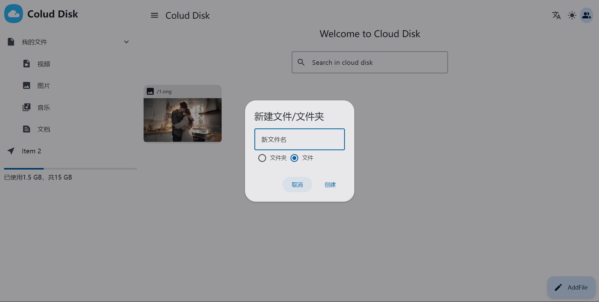
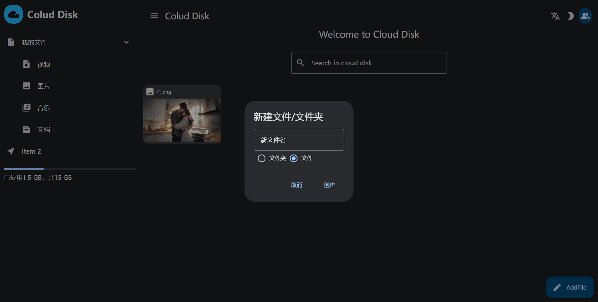

# Cloud Disk


[](https://github.com/neovim/neovim)

Cloud Disk is a web online disk system developed based on Vue. Compared with traditional network disks, Cloud Disk focuses more on user use and individual user use.

## Showcase


### night model


## Recommended IDE Setup

[VSCode](https://code.visualstudio.com/) + [Volar](https://marketplace.visualstudio.com/items?itemName=Vue.volar) (and disable Vetur).

## Customize configuration

See [Vite Configuration Reference](https://vitejs.dev/config/).

## Project Setup

```sh
npm install
```

### Compile and Hot-Reload for Development

```sh
npm run dev
```

### Compile and Minify for Production

```sh
npm run build
```
